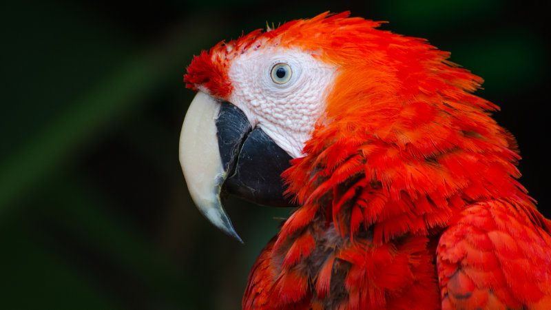
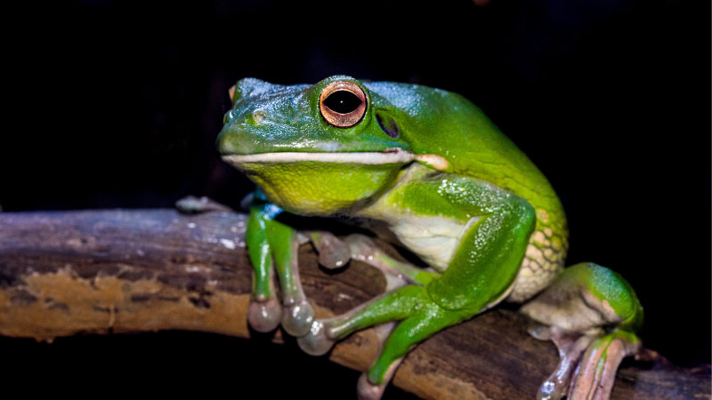
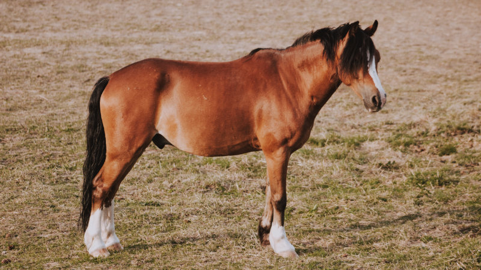
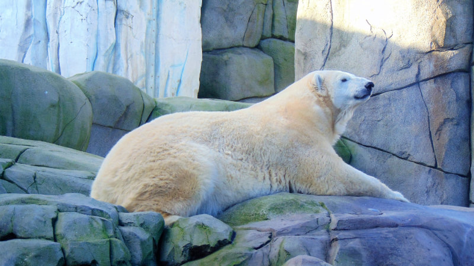

## Learn colors with your child

This is a simple excercise you can play together with your child.

Below is a list of colors and for each color there is a photo of an animal. The color of the animal mathes the title.

## Task
Go through the list from top to bottom, ask your child what animal does he/she see and talk about the color of the animal.

## Start

### Red

### Yellow

### Brown

### White

